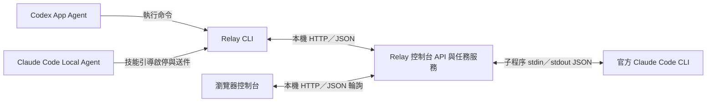

# Relay 0.5.0 安裝與 Agent 操作

一般安裝：雙擊 **QuickStart.cmd**，依[三步快速啟動](QUICKSTART.zh-TW.md)完成登入與連線（[English](QUICKSTART.md)）。下方保留手動安裝及全域 skill 選項。

LLM 操作入口：[繁體中文完整指南](AGENT_GUIDE.zh-TW.md) | [English agent guide](AGENT_GUIDE.md)。
GUI 支援 English／繁體中文；於頁首切換，保留草稿與原請求識別。

## Windows 執行檔版（免安裝 Python）

下載 `relay-collaboration-0.5.0-windows-x64.zip`，完整解壓到可寫入目錄，雙擊 **Relay.exe**。首次執行建立相鄰的 `relay.local.json` 與私人 runtime，啟動隱藏服務並開啟控制台。啟動視窗會結束；服務繼續在背景執行。已存在的設定會保留。若所選連接埠被另一份 Relay／其他程式佔用，會拒絕啟動，不接管或關閉原有服務。

雙擊 **Install.cmd** 會呼叫 `Relay.exe install`，初始化並安裝兩端共用技能；不安裝全系統 Python、不建立 venv、不啟動模型任務。之後直接在 Agent 使用下列技能命令。EXE 也保留完整 CLI：

```powershell
.\Relay.exe --version
.\Relay.exe launch
.\Relay.exe status
.\Relay.exe doctor
.\Relay.exe stop
.\Relay.exe install --agents both
.\Relay.exe --config .\another-profile.json app inbox
```

`launch --no-browser` 可只啟動服務。EXE 未指定 `--config` 時，一律使用 EXE 所在目錄的 `relay.local.json`，不受目前工作目錄影響。自訂設定可傳絕對路徑；要安裝共用技能時，所選 config 須在同一份安裝目錄內。更換受管理技能的安裝／設定位置用 `Relay.exe install --rebind`，自訂技能搜尋路徑用 `--codex-skills-dir`／`--claude-skills-dir`。

EXE 技能的 installation.json 記錄 `executable`，來源版記錄 `python`，共用的 run-relay.ps1 會自動選擇。兩種版本的任務協定一致。官方 Claude Code CLI 與每台電腦自己的授權仍須配置；EXE 不提供模型或可攜登入。

EXE 為 Windows x64；附 BUILD_INFO.json、SHA-256 manifest 與第三方 runtime 授權文件。此本機發行檔未做發行者程式碼簽章。PyInstaller onefile 會在暫存目錄解開自帶 runtime，結束後由 bootloader 清理；私人任務資料仍在設定的 runtime 路徑，不寫入解壓暫存目錄。

## Python 來源版

另行提供不含 EXE 的來源 ZIP，包含程式、離線安裝腳本、Codex App 技能與 Claude Code 技能。來源版需要已安裝的 Python 3.11+；首次建立 venv 不需要 pip 或下載套件。以下 Python 安裝命令適用於來源版；一般使用者可直接選上面的 EXE 版。

## 在另一台電腦安裝

1. 將發行 ZIP 解壓到要長期保留的可寫入目錄，例如 `D:\Tools\Relay`。不要直接在 ZIP 裡執行。
2. 雙擊 `Install.cmd`。它會建立 `.venv`、乾淨的 `relay.local.json` 與私人 runtime，並為目前 Windows 使用者安裝兩個共用技能。既有設定不會被覆蓋。不需要系統管理員安裝，也不會變更永久 PowerShell execution policy。
3. 在 Codex App 刷新技能清單；若尚未出現，開新任務或重啟 App。輸入 `$relay-codex-app 請啟動 Relay 並連接目前任務，展示控制台`。也可直接說「請啟動 Relay」，由 Agent 選用技能。
4. 在 Claude Code 的本機環境輸入 `/relay-claude-code 請檢查 Relay 狀態` 或 `/relay-claude-code 請啟動 Relay`。Claude Desktop 請使用具備本機命令執行能力的 Code／Local；一般 Chat 與雲端環境不會因此取得本機控制能力。
5. Claude worker 在乾淨安裝時會顯示尚未配置。依 [設定與登入](CONFIGURATION.md) 選擇自己安裝的官方 Claude Code 執行檔，使用這台電腦自己的官方登入流程。Codex App 沿用目前登入，但每台電腦的任務仍需各自 attach。執行 `doctor` 確認 ready，再用自己的任務驗證模型。

若需要自動收件，在綁定的 Codex App 任務說「請每五分鐘自動收取 Relay 任務，有新回覆或失敗才通知」。技能會使用 App 的排程工具；安裝程式本身不建立排程。App 必須保持執行，沒有即時推播保證。

不要分享已用過的整個安裝目錄；只分享原始發行 ZIP。runtime、provider-auth、Codex task binding 與工作歷史均不可當成可攜登入。

## 技能位置與命令

| 端點 | 目前使用者的預設技能目錄 | 呼叫方式 |
| --- | --- | --- |
| Codex App | `%CODEX_HOME%\skills\relay-codex-app`，未設定時 `%USERPROFILE%\.codex\skills\relay-codex-app` | `$relay-codex-app 請啟動 Relay` |
| Claude Code Local | `%USERPROFILE%\.claude\skills\relay-claude-code` | `/relay-claude-code 請啟動 Relay` |

每個技能包含 `SKILL.md`、`run-relay.ps1`、只記錄路徑與版本的 `installation.json`，以及檔案 SHA-256 管理清單。它們指向本機解壓位置，技能可以從其他工作目錄使用；仍須遵守 Agent 對該目錄的操作權限。通用指目前 Windows 使用者共用，不是安裝到所有帳號。

PowerShell 進階安裝命令（在解壓根目錄執行）：

```powershell
powershell -NoProfile -ExecutionPolicy Bypass -File .\scripts\install.ps1 -CodexApp -Initialize -InstallSkills both
```

可選 `-InstallSkills codex` 或 `claude`，並用 `-Config <設定路徑>` 選擇同一安裝目錄裡的其他 profile。只安裝技能、不初始化 runtime 時省略 `-Initialize`。保留舊版腳本用法；未提供 `-InstallSkills` 就不修改共用技能。

可用 `-CodexSkillsDir`、`-ClaudeSkillsDir` 指定技能搜尋目錄。例如採用 `.agents/skills` 的 Codex 環境可傳入 `-CodexSkillsDir "$env:USERPROFILE\.agents\skills"`。一個宿主只安裝一份同名技能，避免重複選用。

要直接呼叫已安裝技能的命令入口：

```powershell
powershell -NoProfile -ExecutionPolicy Bypass -File "$env:USERPROFILE\.codex\skills\relay-codex-app\run-relay.ps1" status
powershell -NoProfile -ExecutionPolicy Bypass -File "$env:USERPROFILE\.codex\skills\relay-codex-app\run-relay.ps1" app inbox
```

這些是 Agent 實際使用的命令；人不必先手動開 PowerShell 視窗。登入、啟停與改檔仍受 Agent 本身的權限管理。

## 升級、改位置與移除

重新執行相同安裝會保持既有設定與未變動的技能。若技能已人工修改、有額外檔案或不是 Relay 管理，安裝器會保留並報錯；先自行保留修改，再選另一個技能目錄或處理衝突。

若要切換到另一份安裝／設定，明確加 `-RebindSkills`。這只切换未被修改的受管理技能，不搬移 runtime 或登入。版本升級可在原安裝內更新公開程式；先停止該 profile 的服務，保留設定、`.venv`、runtime，再更新程式與重裝技能、重新啟動。不要把舊 runtime 複製到新的絕對路徑。

整個工具換位置時，使用新的乾淨解壓目錄，重新執行安裝與 `-RebindSkills`，並在新 runtime 登入。Windows venv 不保證可搬移。若只是要移除技能，可移除表列的兩個 Relay 技能資料夾；不必刪除其他技能、帳號或 runtime。先停止 Relay，再處理其私人資料。

## 多 instance

不必重綁全域技能：在同一 launcher 的子命令前加 `--instance <name>`，每次都選取指定的
獨立設定與 runtime。建立／列出、兩個方向的派工與每份官方登入見 [INSTANCES.md](INSTANCES.md)。
全域 launcher 的 base config 保持不變；更新技能說明前可直接閱讀套件內兩端 SKILL.md。

## Agent 如何與 Relay 通訊



Skill 是操作說明；CLI 是 Agent 的工具入口；HTTP 是本機服務的通訊方式。App 的 `inbox/reply/ack/send` 使用控制台 API，配合 session／Origin／CSRF 檢查。預設 App 模式控制台在 `127.0.0.1:9142`，broker 在 `127.0.0.1:9141`；實際以設定為準。broker 可另外選用 file transport，以 JSON 檔收送任務。

目前沒有 MCP server、WebSocket 或直接 Winsock 整合。HTTP 底層使用 TCP socket。Codex App 主動取件並回覆；Relay 不會直接控制或讀取任意 App 對話。Claude worker 使用官方 CLI 的非互動呼叫，沒有操作 Claude 網頁聊天介面。從 Claude Code 啟動服務，也不會把當前 Claude Code 對話綁成 worker。

支援邊界參考：[Codex skills](https://learn.chatgpt.com/docs/build-skills)、[Claude Code skills](https://code.claude.com/docs/en/skills)、[Claude Desktop Code 本機環境](https://code.claude.com/docs/en/desktop-quickstart)。實測範圍见 [驗收紀錄](VALIDATION.md)。
