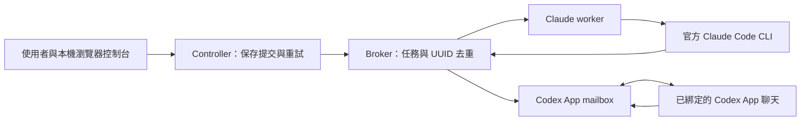

# Relay Collaboration 完整使用說明

本文件說明 0.5.0 來源系列於 2026-10-07 準備的 GitHub 來源快照。Windows 是目前主要驗證平台。先閱讀[發行狀態](RELEASE_STATUS.md)，再依自己的使用方式安裝。

## 1. 工具用途與架構

Relay 是本機 Codex／Claude 協作通道，適合程式審查、設計討論與提案。使用者或主控 LLM 提供明確文字／附件，接收方產生回覆，控制台保留輸入、回覆與任務識別碼。需要下一輪時，由使用者或已授權主控再送出新任務。



背景 supervisor 管理 broker、控制台及各 consumer。HTTP 與 file 任務通道共用持久化協定；瀏覽器控制台仍使用本機 HTTP。CLI 雙向模式另可使用 Codex CLI adapter。

模型只收到明確附上的內容；設定 `project.root` 不會授權模型掃描整個專案。Relay 不自動執行模型回覆的命令，也不提供自動改檔或無限來回模型迴圈。

## 2. 功能與需求

| 功能 | 說明 |
| --- | --- |
| 雙向派工 | Codex → Claude、Claude → Codex |
| 控制台 | 英文／繁體中文、任務資料流、附件、回覆與連線管理 |
| 持久化 | UUID 去重、提交 journal、完成 receipt、保守恢復 |
| 多 instance | 各自設定、連接埠、runtime、登入與 App 綁定 |
| 模型選擇 | CLI 使用 model show/set；App 在綁定聊天內選擇 |
| 安裝入口 | QuickStart.cmd、PowerShell、Python CLI、兩端 skill 範本 |

來源版需要 Windows、Python 3.11 以上；App 模式需要 Codex App 與官方原生 Claude Code CLI。CLI 模式各自需要相應官方 CLI 與本人登入。Relay 執行時只使用 Python 標準函式庫。Node.js 僅供前端開發測試；PyInstaller 僅供 EXE 建置。

第三方工具、模型與訂閱不隨套件附送。模型選單只是配置便利入口，不保證帳號有權使用。舊 0.5.0 EXE 與目前來源快照具有不同功能範圍。

## 3. 安裝與首次啟動

1. 下載來源 ZIP 與同名 manifest，執行驗證後完整解壓到可寫入目錄，例如 `D:\Tools\Relay`。
2. 雙擊 `QuickStart.cmd`，選擇語言、資料目錄與 instance 名稱。
3. 若從 Git clone 執行，把資料目錄設在倉庫之外，例如 `D:\RelayData`。不要將私人 runtime 建在 Git 祖先目錄內。
4. 依精靈指定官方 Claude CLI；完成所選 instance 的官方登入。
5. 開啟實際回傳的 `console_url`，貼上產生的 Codex 連線指示到預定參與的聊天。反向派工時，也將 Claude 指示交給 Claude Code。
6. 檢查 Claude readiness、Codex 綁定與收件狀態，再送出一筆簡單審查並檢查 completed receipt。

精靈成功只代表環境操作成功；`doctor` 的登入成功也不代表模型已成功處理任務。精確選項見[三步快速啟動](QUICKSTART.zh-TW.md)。

無互動準備範例：

```powershell
powershell -NoProfile -ExecutionPolicy Bypass -File 'D:\Tools\Relay\scripts\quickstart.ps1' -NoWizard -DataDir 'D:\RelayData' -Name research-a -Language zh-TW -Start
```

此入口不冒充 App 連線、不解除既有 owner，也不複製其他 instance 的登入。需要互動登入時按精靈提示進行。

## 4. 日常操作與雙向協作

所有操作固定使用同一份完整設定路徑。以下 `relay.local.json` 路徑是範例，請使用精靈實際回傳值。

```powershell
python -B -X utf8 'D:\Tools\Relay\relay.py' --config 'D:\RelayData\instances\research-a\relay.local.json' doctor
python -B -X utf8 'D:\Tools\Relay\relay.py' --config 'D:\RelayData\instances\research-a\relay.local.json' start
python -B -X utf8 'D:\Tools\Relay\relay.py' --config 'D:\RelayData\instances\research-a\relay.local.json' status
python -B -X utf8 'D:\Tools\Relay\relay.py' --config 'D:\RelayData\instances\research-a\relay.local.json' stop
```

在 GUI 選擇方向，填入標題、明確問題與必要附件。確認保存後以原 UUID 追蹤。Claude worker 自動認領寄給 Claude 的任務；Codex App 由已綁定聊天收件、回覆並 ACK。App 收件須保持執行；定期收件依已設定的 App heartbeat，沒有排程時需要手動查收。

回覆完成後，「把回覆交回另一方」會建立下一輪草稿，確認後才送出新任務。App ownership 衝突時先查明 owner／delivery 狀態，再依[連線管理](CODEX_APP.md)預覽和確認解除；不要直接刪除綁定檔案。

兩端 LLM 的精確操作順序、收件、回覆、ACK 與派工命令，見[完整 Agent 操作指南](AGENT_GUIDE.zh-TW.md)。

## 5. 多 instance 與模型設定

不同研究或開發工作可建立不同 instance，隔離任務、連接埠與綁定。每次指令必須選對設定；使用完整具名設定路徑時，不要再混用基底 `--instance`。詳見[instance 指南](INSTANCES.md)。

```powershell
python relay.py --config 'D:\RelayData\instances\research-a\relay.local.json' model show
python relay.py --config 'D:\RelayData\instances\research-a\relay.local.json' stop
python relay.py --config 'D:\RelayData\instances\research-a\relay.local.json' model set --actor claude --model default --effort default
python relay.py --config 'D:\RelayData\instances\research-a\relay.local.json' start
```

`default` 清除覆寫；省略欄位保留原設定。CLI 模型設定只能在 instance 已停止且程序身分確認時變更。Codex App 模型在已綁定聊天內選擇。檢查 receipt 的 requested／reported model；未回報就保留未驗證。詳細 schema 與範本見[設定文件](CONFIGURATION.md)。

## 6. 任務狀態與故障處理

| 狀況 | 處理方式 |
| --- | --- |
| pending／provider unavailable | 檢查同一設定的 doctor、官方 CLI 路徑與登入；任務尚未完成 |
| App 沒有收到 | 檢查 App 是否執行、聊天 owner、heartbeat 與既有 delivery |
| 送出逾時／uncertain | 先查原 UUID，再 retry 原 UUID；不要新建一筆代替 |
| manual_review | 保存 journal／receipt，先釐清是否已執行；不要盲目重跑 |
| CLI 更新後路徑失效 | 正常停止該 instance，使用 QuickStart 指定新官方路徑，再 doctor |
| capabilities_present_in_no_tools_profile | 輸出能力檢查拒絕；保留私有 evidence，不能當成 accepted review |
| stop 無法確認 | 查同設定的 status／service.log；不要猜 PID 強殺或啟動第二個 supervisor |
| 連接埠被占用 | 使用另一份 fresh instance 或診斷既有占用者；不要停止不屬於本工具的服務 |

相同 UUID 重送內容必須一致；跨 fresh runtime 不共享去重。模型執行期間崩潰或完成回報不確定時，無法保證外部副作用 exactly-once。完整處理見[操作與恢復](OPERATIONS.md)、[協定](PROTOCOL.md)。

## 7. 資料、安全與備份

runtime 包含認證、SQLite、原始 prompt、結果、journal 與 evidence，整份視為私人資料。模型提供者會收到你明確提交的內容；請先確認內容可以交給該提供者。不要在附件放入 bearer／claim token、登入憑證或不應公開的資料。

本機端點限定 loopback。ACL、Origin／CSRF、路徑和能力檢查是操作防護，不能隔離同使用者或管理員惡意程式。這個版本不提供外網 broker，也不提供任意命令執行 sandbox。

備份前正常停止自己的 instance，保留設定、runtime 身分、權限與原路徑。沒有跨 runtime／跨機 journal 搬遷工具。每台新電腦應建立 fresh runtime 並自行官方登入；不要搬移憑證或複製 live SQLite。詳見[移轉](MIGRATION.md)。

## 8. 開發、測試、封裝與更新

測試請在 Git 目錄之外的乾淨來源 ZIP 解壓目錄執行，建議使用 `D:\RelayQA` 等短路徑。部分 fixture 在來源內建立私人 runtime，從 Git checkout 直接跑全套測試會觸發祖先目錄防護；深層 Windows 測試路徑也可能失敗。保留檢查，改用短路徑解壓驗證。

```powershell
python -B -X utf8 -m unittest discover -s tests -t . -v
node --test tests/test_frontend.mjs
python -B -X utf8 scripts/package.py --output-dir dist/new-source-snapshot
python -B -X utf8 scripts/verify-package.py dist/new-source-snapshot/relay-collaboration-0.5.0.zip --manifest dist/new-source-snapshot/relay-collaboration-0.5.0.manifest.json
```

測試使用 fixtures；通過不等於真模型或第二台電腦驗收。封裝以白名單選取來源，不要 ZIP 整個開發目錄。manifest 驗證內容完整性，不能替代公開內容審查。

更新前先完成／釐清 pending 工作並正常停止；只更新公開程式，保留私人設定、runtime 與 receipt。新版 App binding v2 的回滾限制見 OPERATIONS.md。不要用重新 init 或刪除歷史解決升級問題。

## 9. 文件索引與問題回報

- [英文／中文快速啟動](QUICKSTART.md)、[中文快速啟動](QUICKSTART.zh-TW.md)
- [安裝與 skills](INSTALLATION.md)、[英文 Agent 指南](AGENT_GUIDE.md)、[中文 Agent 指南](AGENT_GUIDE.zh-TW.md)
- [配置](CONFIGURATION.md)、[多 instance](INSTANCES.md)、[App 連線](CODEX_APP.md)
- [GUI 契約](GUI_CONTRACT.md)、[協定](PROTOCOL.md)、[操作](OPERATIONS.md)、[移轉](MIGRATION.md)
- [驗收歷史](VALIDATION.md)、[版本歷史](RELEASE_NOTES.md)、[目前發行狀態](RELEASE_STATUS.md)
- [分享封裝](SHARING.md)、[第三方整合紀錄](SERVICE_TERMS.md)、[套件與授權說明](../NOTICE.md)

回報問題時附 OS、Python／官方 CLI 版本、來源快照 SHA、已去識別化錯誤、重現步驟與預期／實際結果。不要公開 private runtime、原始模型輸出、客戶資料或憑證。專案尚未選定開源授權；公開可讀不等於授予任意再散布或商用權利。
